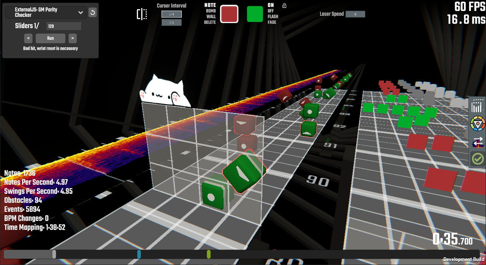

# ChroMapper Error Checker

Simple plugin that adds an error checker to [ChroMapper](https://github.com/Caeden117/ChroMapper)

### Installation

Download the latest release, place the entire folder in your `ChroMapper/Plugins` directory

### Built-in plugins
* Vision Blocks
  * Copy of the logic in MMA2's error checker
  * Finds blocks that are obscured by blocks in the center two positions
* Stacked Blocks
  * Finds blocks that may be overlapping
  * Looks for notes less than 0.1 beats of each other in the same position

### JS Checks

You can add more error check types directly by placing javascript files in the same directory as the plugin.

The parser uses [Jint 3 (beta)](https://github.com/sebastienros/jint/issues/343) and [esprima](https://github.com/sebastienros/esprima-dotnet) which can parse ES6 but not all features are supported, for instance esprima can parse `class` but Jint will through an exception so you'll have to rewrite these as old-style functions and prototypes

As this is essentially alpha the interface for these checks may change but for now you just need to create a block similar to:
```
module.exports = {
	name: "My error check",
	params: {"Min Time": 0.24},
	performCheck: function(data, minTime) { }
};
```

* **name** appears in the drop-down ingame.
* **params** is an object, for each key a text field will be show to the user where they can enter a value which will be passed to you as a float
* **performCheck** is a function that will be called when the user runs your check
  * The first parameter to the function will have information about the map. For now it only contains `notes` which has a list of all the notes ordered by time (I can't guarantee what order notes that happen at the same time will be in for now)
  * Extra parameters will be provided based on what you've supplied in params. I _assume_ this will be returned in order, how these are provided may have to change

Two functions will be defined before calling `performCheck`
* **addError**(note, reason) - Pass back the problem note object, all it's properties (except `_customData`) must match the original passed note for it to be marked properly and you can provide a reason as the second parameter
* **addWarning**(note, reason) - The same as `addError` except the note will only be highlighted yellow

[There are example scripts in Examples](Examples)


